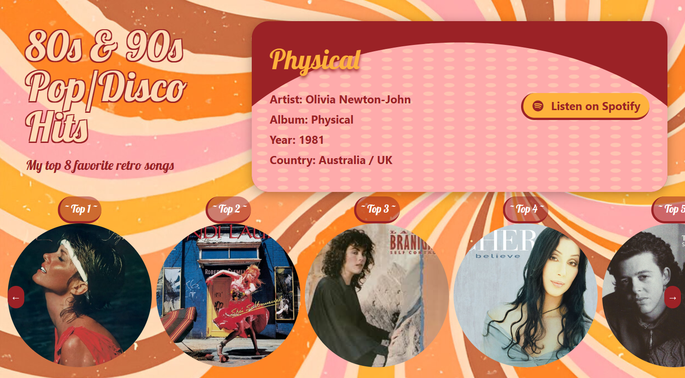

# Mis 8 Canciones Favoritas - WEBSITE 🎶

Este es un sitio web dedicado a presentar y recomendar mis 8 canciones favoritas. La página permite explorar cada canción con detalles adicionales y escucharla en Spotify a través de un enlace directo.

## Descripción

- **Exploración de Canciones**: El sitio web muestra una selección de 8 canciones favoritas con su respectiva portada.
- **Modal de Información**: Al hacer clic en la portada de una canción, se abre un modal en la parte superior con detalles de la canción, incluyendo el nombre, artista y una breve descripción.
- **Escucha en Spotify**: Dentro del modal, se incluye un enlace “Listen on Spotify” para que puedas escuchar la canción completa en la plataforma.

## Captura de Pantalla

## Link en Producción

La página está disponible en el siguiente enlace:

[Mis 8 Canciones Favoritas - Sitio en Producción](https://brenda-0021.github.io/Pagina-con-Tailwind/)

## Tecnologías Utilizadas

- **HTML**: Estructura principal de la página.
- **Tailwind CSS**: Estilizado y diseño responsive.

---
